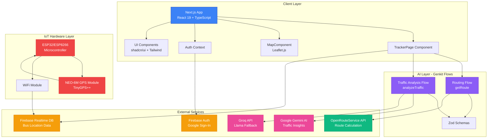
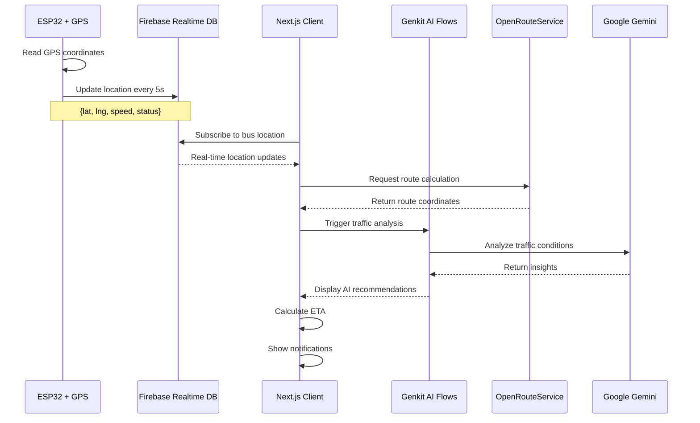

# BusLive

Real-time bus tracking system with AI-powered traffic insights & live location updates.

**[Live Demo](https://bus-live.vercel.app)**

## Problem Statement

Public transport lacks real-time visibility, causing unpredictable wait times & poor passenger experience. BusLive provides GPS tracking with ESP32/ESP8266 hardware, live locations, ETAs, capacity indicators, & smart notifications. Demo showcases college campus transportation.

## Features

- **Real-Time Tracking** - Live bus location updates on interactive maps
- **Smart Search** - Find buses by number, route, or destination
- **Favorite Routes** - Save frequently used routes with localStorage
- **Capacity Indicators** - Color-coded occupancy visualization
- **Share Location** - Share live tracking via Web Share API
- **AI Traffic Analysis** - Gemini AI-powered insights & delay predictions
- **Smart ETA** - Dynamic arrival time predictions
- **Route Visualization** - Complete journey path display
- **Smart Alerts** - Notifications when bus is approaching
- **Loading States** - Skeleton loaders for smooth UX
- **Authentication** - Google Sign-In & Email/Password
- **Dark Mode** - Theme switching with persistence
- **Responsive Design** - Works on mobile & desktop

## Architecture

### System Architecture



### Data Flow



## Tech Stack

| Layer    | Technologies                                          |
| -------- | ----------------------------------------------------- |
| Frontend | Next.js 16, React 19, TypeScript, Tailwind, shadcn/ui |
| Maps     | Leaflet.js, React Leaflet, OpenRouteService API       |
| Backend  | Firebase Auth + Realtime Database                     |
| AI       | Google Gemini, Groq (Llama), Genkit                   |
| Hardware | ESP32/ESP8266, NEO-6M GPS, TinyGPS++                  |

## Quick Start

```bash
# Install dependencies
npm install

# Configure environment variables
cp .env.example .env

# Run development server
npm run dev
```

Visit `http://localhost:3000`

### Environment Variables

```env
NEXT_PUBLIC_FIREBASE_API_KEY=
NEXT_PUBLIC_FIREBASE_AUTH_DOMAIN=
NEXT_PUBLIC_FIREBASE_DB_URL=
NEXT_PUBLIC_FIREBASE_PROJECT_ID=
NEXT_PUBLIC_FIREBASE_STORAGE_BUCKET=
NEXT_PUBLIC_FIREBASE_MESSAGING_SENDER_ID=
NEXT_PUBLIC_FIREBASE_APP_ID=
NEXT_PUBLIC_OPENROUTESERVICE_API_KEY=
GOOGLE_GENAI_API_KEY=
GROQ_API_KEY=
```

## Project Structure

```
src/
├── app/
│   ├── page.tsx              # Main entry
│   ├── login/                # Authentication
│   └── bus-selection/        # Route selection
├── components/
│   ├── TrackerPage.tsx       # Live tracking
│   ├── MapComponent.tsx      # Leaflet map
│   └── ui/                   # shadcn components
├── context/
│   └── AuthContext.tsx       # Auth state
├── lib/
│   ├── firebase.ts           # Firebase config
│   └── utils.ts              # Helpers
└── ai/
    ├── flows/                # Genkit AI flows
    └── schemas/              # Zod schemas
```

## Inspiration

Inspired by Smart India Hackathon 2025 PS #25013 (Government of Punjab) - Real-Time Public Transport Tracking for Small Cities. Implements low-cost GPS tracking with IoT hardware & mobile-first design for scalable bus tracking solutions.

## Contributing

We welcome contributions! Check out our [Contributing Guide](CONTRIBUTING.md) to get started.

## License

MIT
